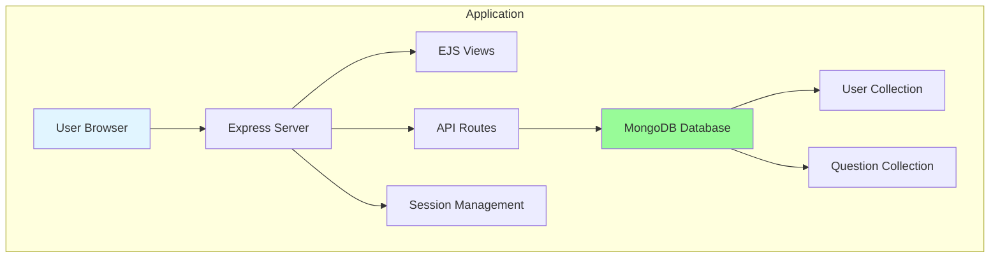
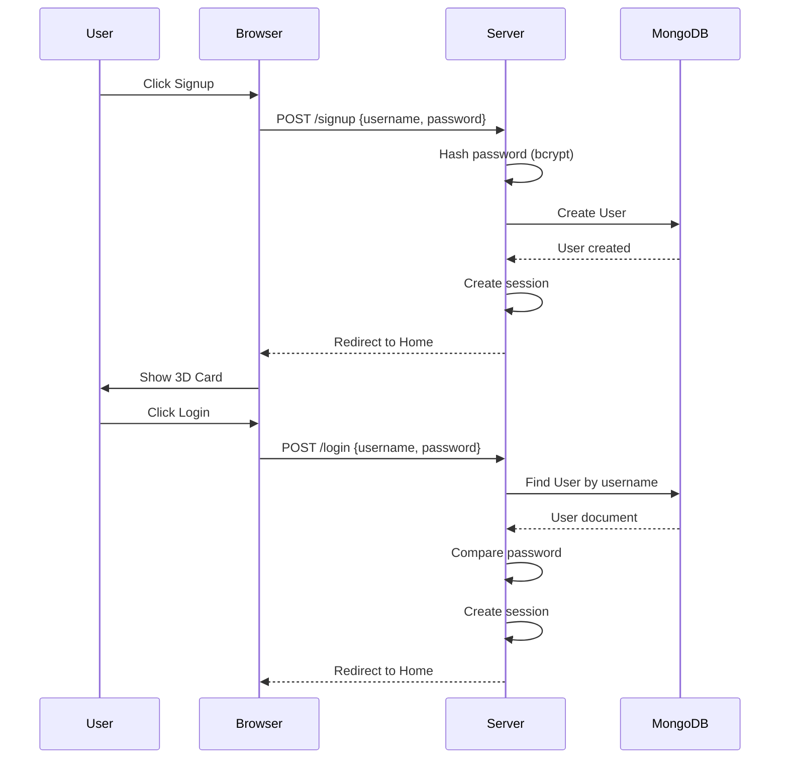
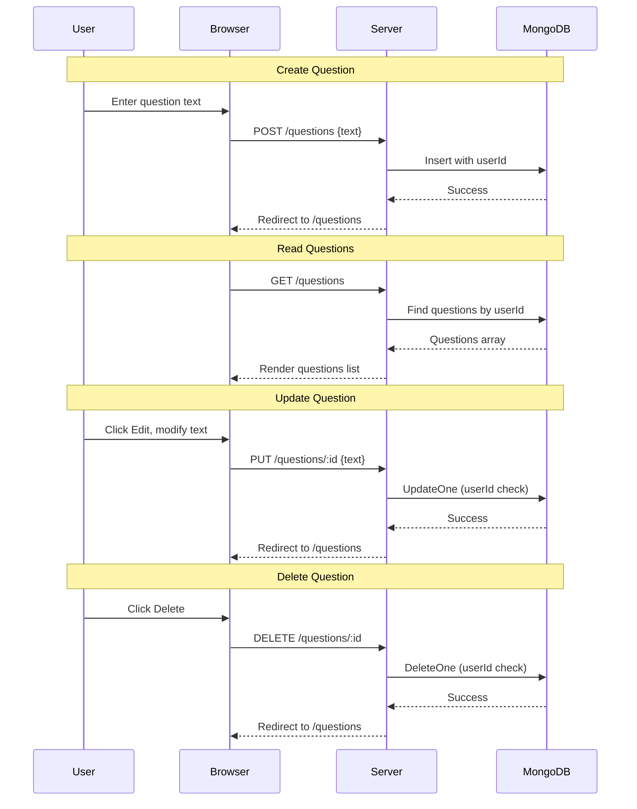

# 3Dcard - Social Icebreaker Game

A web-based social icebreaker game that helps break awkward silences when people meet for the first time. Features an interactive 3D western-style playing card with mouse-tilt effect.

## Features

- **Interactive 3D Card**: Western-style playing card with smooth flip animation and mouse-tilt effect
- **Question Management**: Full CRUD operations (Create, Read, Update, Delete) for conversation questions
- **User Authentication**: Secure signup/login with password hashing
- **Customizable**: Easy-to-replace card and background images
- **Responsive Design**: Works on desktop and mobile devices

## Project Structure

```
3Dcard/
├── full-app/                # Full application
│   ├── server.js           # Express server
│   ├── models/             # MongoDB schemas
│   │   ├── User.js        # User schema
│   │   └── Question.js    # Question schema
│   ├── views/             # EJS templates
│   │   ├── home.ejs
│   │   ├── login.ejs
│   │   ├── signup.ejs
│   │   ├── questions.ejs
│   │   └── documentation.ejs
│   ├── public/
│   │   ├── css/style.css
│   │   └── js/card.js
│   ├── package.json
│   └── .env.example
│
├── compliance/             # Legal & accessibility docs
│   ├── accessibility-statement.md
│   ├── digital-services-act.md
│   ├── data-protection-security.md
│   ├── gdpr-compliance.md
│   ├── privacy-policy.md
│   └── cookies-policy.md
│
└── docs/                   # Project documentation
    └── README.md
```

## Tech Stack
- **Frontend**: HTML, CSS, Vanilla JavaScript, Three.js
- **Backend**: Node.js, Express.js
- **Database**: MongoDB with Mongoose ODM
- **Templating**: EJS (Embedded JavaScript)
- **Authentication**: Express-session, bcryptjs

## System Architecture



## Database Schema

```mermaid
erDiagram
    USER ||--o{ QUESTION : creates

    USER {
        ObjectId _id PK
        string username UK
        string_password "hashed password"
        Date createdAt
        Date updatedAt
    }

    QUESTION {
        ObjectId _id PK
        string text
        ObjectId createdBy FK
        Date createdAt
        Date updatedAt
    }
```

## Authentication Flow



## Question CRUD Flow



## Installation

**Prerequisites:**
- Node.js (v14 or higher)
- MongoDB (local installation or MongoDB Atlas account)

**Setup:**

1. Install dependencies:
```bash
cd full-app
npm install
```

2. Create `.env` file from example:
```bash
cp .env.example .env
```

3. Edit `.env` with your configuration:
```env
PORT=3000
MONGODB_URI=mongodb://localhost:27017/3dcard
SESSION_SECRET=your-random-secret-key
```

4. Start MongoDB (if using local):
```bash
mongod
```

5. Run the application:
```bash
npm start
# or for development with auto-reload:
npm run dev
```

6. Open http://localhost:3000

## Customization

### Changing the Background

Edit the CSS file (`full-app/public/css/style.css`) around line 20:

```css
background: url('your-background-image.jpg') center/cover no-repeat;
```

### Changing Card Images

Edit the card.js file in your version and look for the customization section:

```javascript
// 🔧 Replace with your image URLs (714 x 1000px recommended)
const CARD_BACK_IMAGE = 'your-card-back.png';  // Western art
const CARD_FRONT_IMAGE = 'your-card-front.png'; // Question side
```

**Recommended dimensions:** 714 x 1000 pixels (2.5:3.5 ratio - standard poker card)

### Card Back Art

The card back should feature western/saloon themed artwork. You can:
- Create your own western art
- Use stock images
- Commission an artist

## API Endpoints (Full App)

| Method | Endpoint | Description | Auth Required |
|--------|----------|-------------|---------------|
| GET | `/` | Home page with 3D card | No |
| GET/POST | `/signup` | User registration | No |
| GET/POST | `/login` | User login | No |
| GET | `/logout` | User logout | Yes |
| GET | `/questions` | Questions management page | Yes |
| POST | `/questions` | Create new question | Yes |
| PUT | `/questions/:id` | Update question | Yes |
| DELETE | `/questions/:id` | Delete question | Yes |
| GET | `/api/questions/random` | Get random question | Yes |

## User Features

### Full Application
- ✅ Interactive 3D card with flip animation
- ✅ Mouse-tilt effect
- ✅ Question CRUD (MongoDB)
- ✅ User signup and login
- ✅ Persistent question storage (MongoDB)
- ✅ Each user sees only their own questions
- ✅ Secure password hashing
- ✅ Session management

## Browser Compatibility

- Chrome 90+
- Firefox 88+
- Safari 14+
- Edge 90+

## License

© 2026 3Dcard. School project.

## Author

Petri

---

**Note:** This project was built as a school assignment with a 5-day timeline. It demonstrates full-stack JavaScript development with Three.js 3D graphics, MongoDB integration, and MVC architecture.
