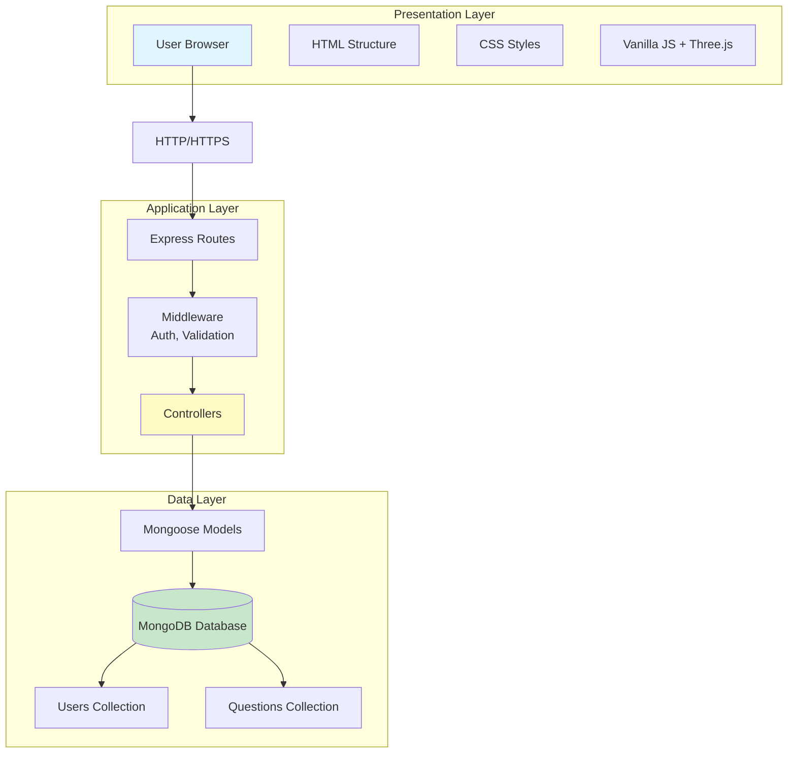
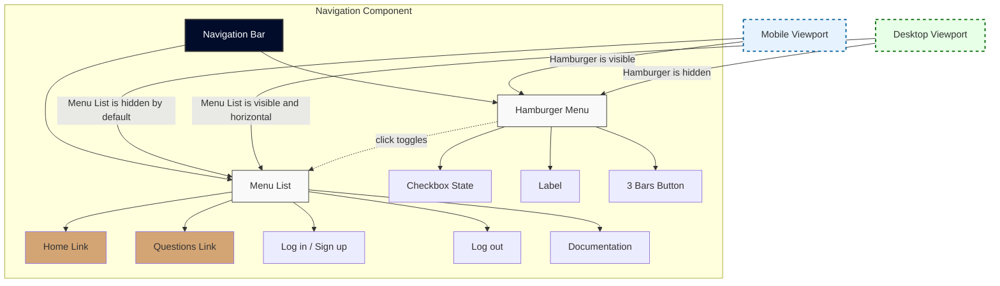
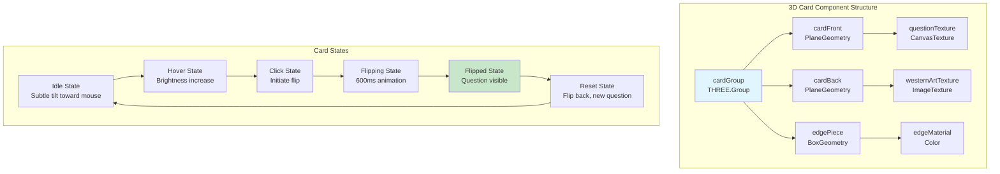
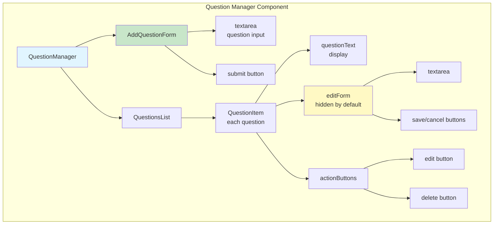
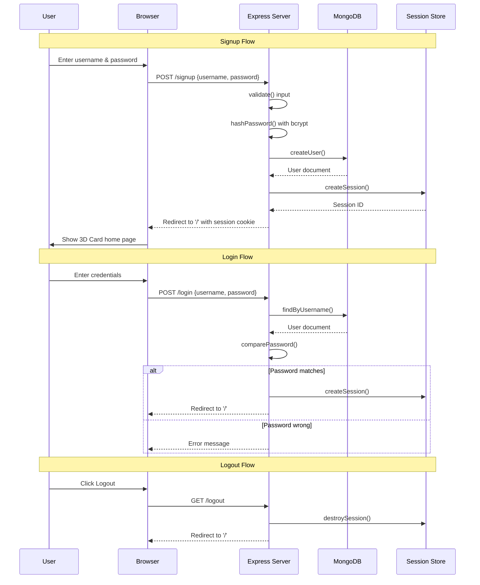
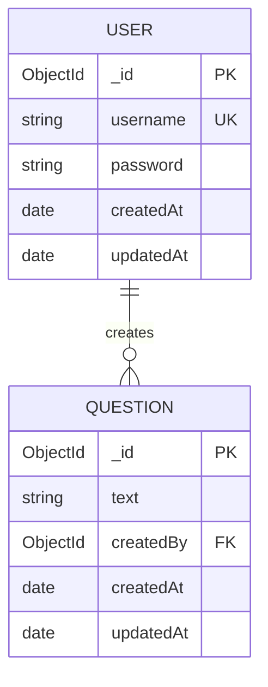
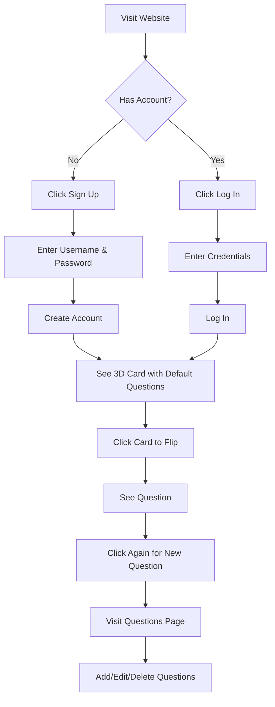
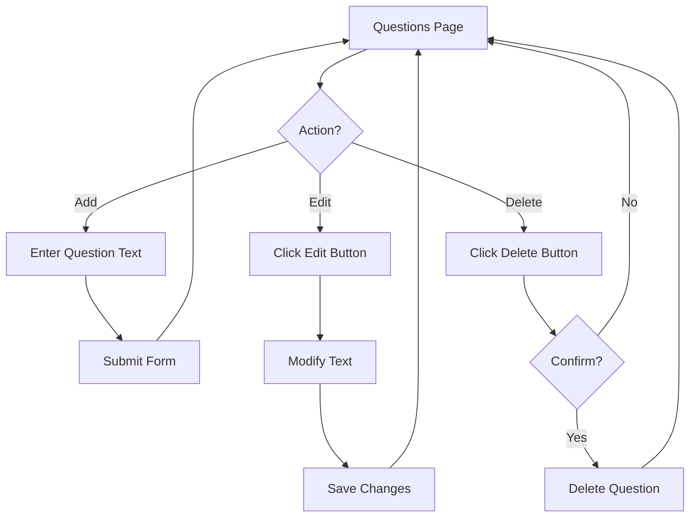

# 3Dcard - Design Document

**Project:** 3Dcard - Social Icebreaker Game
**Version:** 1.0.0
**Author:** Petri
**Date:** February 2026

---

## 1. System Design Overview



### 1.1 Architecture Pattern

3Dcard follows the **Model-View-Controller (MVC)** architectural pattern, separating concerns between data management, user interface, and business logic.

```
┌─────────────────────────────────────────────────────────────┐
│                        CLIENT LAYER                         │
│  ┌────────────┐  ┌────────────┐  ┌──────────────────────┐  │
│  │   HTML     │  │    CSS     │  │  Vanilla JavaScript  │  │
│  │  Structure │  │   Styles   │  │   + Three.js         │  │
│  └────────────┘  └────────────┘  └──────────────────────┘  │
└────────────────────────────┬────────────────────────────────┘
                             │ HTTP/HTTPS
┌────────────────────────────▼────────────────────────────────┐
│                    SERVER LAYER (Express)                   │
│  ┌──────────────────────────────────────────────────────┐  │
│  │                    ROUTES                             │  │
│  │  /, /signup, /login, /logout, /questions, API        │  │
│  └───────────────────────────┬──────────────────────────┘  │
│                              │                             │
│  ┌───────────────────────────▼──────────────────────────┐  │
│  │                   CONTROLLERS                         │  │
│  │  - Request validation                                │  │
│  │  - Business logic                                    │  │
│  │  - Response formatting                               │  │
│  └───────────────────────────┬──────────────────────────┘  │
│                              │                             │
│  ┌───────────────────────────▼──────────────────────────┐  │
│  │                     MODELS                            │  │
│  │  User Schema, Question Schema                        │  │
│  └───────────────────────────┬──────────────────────────┘  │
└──────────────────────────────┼─────────────────────────────┘
                               │ Mongoose
┌──────────────────────────────▼─────────────────────────────┐
│                   DATA LAYER (MongoDB)                     │
│  ┌──────────────┐        ┌──────────────┐                 │
│  │  Users       │        │  Questions   │                 │
│  │  Collection  │        │  Collection  │                 │
│  └──────────────┘        └──────────────┘                 │
└─────────────────────────────────────────────────────────────┘
```

### 1.2 Technology Stack

| Layer | Technology | Purpose |
|-------|-----------|---------|
| **Presentation** | HTML5, CSS3, EJS | User interface |
| **Client Logic** | Vanilla JavaScript, Three.js | 3D rendering, interactivity |
| **Server** | Node.js, Express.js | Web server, routing |
| **Data Access** | Mongoose | MongoDB ODM |
| **Database** | MongoDB | Data persistence |
| **Security** | bcryptjs, express-session | Authentication |

---

## 2. Component Design

### 2.1 Frontend Components

#### 2.1.1 Navigation Bar



**Type:** Shared Component
**Technology:** HTML, CSS
**Location:** Fixed at top of all pages

```javascript
// Component Structure
<nav>
  ├── hamburger-menu
  │   ├── checkbox (state)
  │   ├── label
  │   └── button (3 bars)
  └── menu-list
      ├── Home
      ├── Questions (when logged in)
      ├── Log in / Sign up (when logged out)
      ├── Log out (when logged in)
      └── Documentation
```

**States:**
- Default: Horizontal menu on desktop
- Mobile: Collapsed hamburger menu
- Active: Menu expanded with slide animation

#### 2.1.2 3D Card Component



**Type:** Interactive Component
**Technology:** Three.js
**Location:** Center of home page

```javascript
// Component Structure
cardGroup (THREE.Group)
  ├── cardFront (PlaneGeometry)
  │   └── questionTexture (CanvasTexture)
  ├── cardBack (PlaneGeometry)
  │   └── westernArtTexture (ImageTexture)
  └── edgePiece (BoxGeometry)
      └── edgeMaterial (Color)
```

**Behaviors:**
- **Idle:** Subtle tilt toward mouse position
- **Click:** 180-degree flip animation
- **Flipped:** Shows question text
- **Reset:** Flip back for new question

**Animation Timing:**
```javascript
Flip Duration: 600ms
Tilt Smoothing: 0.05 (easing factor)
Max Tilt Angle: ±15 degrees (0.26 radians)
```

#### 2.1.3 Question Manager Component



**Type:** CRUD Interface
**Technology:** HTML forms, JavaScript
**Location:** /questions page

```javascript
// Component Structure
QuestionManager
  ├── AddQuestionForm
  │   ├── textarea (question input)
  │   └── submit button
  └── QuestionsList
      └── QuestionItem (each)
          ├── questionText (display)
          ├── editForm (hidden by default)
          │   ├── textarea
          │   └── save/cancel buttons
          └── actionButtons
              ├── edit button
              └── delete button
```

**State Management:**
```javascript
// Full Application
MongoDB: questions collection
Filter: { createdBy: session.user._id }
```

---

### 2.2 Backend Components

#### 2.2.1 Authentication System



**Type:** Middleware + Controllers
**Location:** routes/auth.js

```javascript
// Authentication Flow
Signup Flow:
  Client → POST /signup → validate() → hashPassword()
  → createUser() → createSession() → redirect('/')

Login Flow:
  Client → POST /login → findByUsername() → comparePassword()
  → createSession() → redirect('/')

Logout Flow:
  Client → GET /logout → destroySession() → redirect('/')
```

**Security Measures:**
- Password hashing: bcrypt, 10 salt rounds
- Session secret: Random string (env variable)
- Cookie maxAge: 24 hours (86400000 ms)
- Session store: Memory (development)

#### 2.2.2 Question Controller

**Type:** CRUD Controller
**Location:** routes/questions.js

```javascript
// CRUD Operations

Create (POST /questions):
  1. Extract question text from request body
  2. Attach session user ID as createdBy
  3. Validate input (5-500 chars)
  4. Save to MongoDB
  5. Redirect to /questions

Read (GET /questions):
  1. Verify user is logged in
  2. Query: { createdBy: session.user._id }
  3. Sort by createdAt: -1
  4. Render questions view

Update (PUT /questions/:id):
  1. Verify user is logged in
  2. Find: { _id: id, createdBy: session.user._id }
  3. Update question text
  4. Save to MongoDB
  5. Redirect to /questions

Delete (DELETE /questions/:id):
  1. Verify user is logged in
  2. DeleteOne: { _id: id, createdBy: session.user._id }
  3. Redirect to /questions
```

#### 2.2.3 API Controller

**Type:** REST API
**Location:** /api/questions/random

```javascript
// Random Question API
GET /api/questions/random:
  1. Verify user authentication
  2. Aggregate: { $match: { createdBy: user._id } }
  3. $sample: { size: 1 }
  4. Return JSON: { _id, text }
```

---

## 3. Database Design

### 3.1 Schema Definitions

#### 3.1.1 User Schema

```javascript
{
  _id: ObjectId("..."),           // Auto-generated primary key
  username: String,               // 3-30 characters, unique, required
  password: String,               // Hashed with bcrypt, min 6 chars
  createdAt: ISODate("..."),      // Auto-generated timestamp
  updatedAt: ISODate("...")       // Auto-updated on save
}

Indexes:
  - username: unique (B-tree)
```

#### 3.1.2 Question Schema

```javascript
{
  _id: ObjectId("..."),           // Auto-generated primary key
  text: String,                   // 5-500 characters, required
  createdBy: ObjectId("..."),     // Foreign key to User
  createdAt: ISODate("..."),      // Auto-generated timestamp
  updatedAt: ISODate("...")       // Auto-updated on save
}

Indexes:
  - createdBy: non-unique (B-tree)
  - compound index: { createdBy: 1, createdAt: -1 }
```

### 3.2 Relationships



### 3.3 Data Access Patterns

**User Queries:**
```javascript
// Find by username (login)
User.findOne({ username: input })

// Create new user (signup)
User.create({ username, password })

// Verify password
user.comparePassword(candidatePassword)
```

**Question Queries:**
```javascript
// Get user's questions
Question.find({ createdBy: session.user._id })
  .sort({ createdAt: -1 })

// Get random question
Question.aggregate([
  { $match: { createdBy: userId } },
  { $sample: { size: 1 } }
])

// Update with ownership check
Question.findOneAndUpdate(
  { _id: id, createdBy: userId },
  { text: newText }
)

// Delete with ownership check
Question.findOneAndDelete(
  { _id: id, createdBy: userId }
)
```

---

## 4. Interface Design

### 4.1 Color Palette

```css
/* Primary Colors */
--navy-dark: #000c2a;        /* Navigation bar background */
--ivory: #fffff0;            /* Menu text, card highlights */
--gold-light: #d4a574;       /* Accents, buttons, links */
--gold-dark: #8b4513;        /* Borders, western theme */

/* Card Colors */
--parchment: #f4e4bc;        /* Card front background */
--card-edge: #d4a574;        /* Card sides/edges */

/* Status Colors */
--error: #c0392b;            /* Error messages */
--success: #27ae60;          /* Success messages */
```

### 4.2 Typography

```css
/* Font Families */
--font-heading: 'Georgia', serif;      /* Headings, card text */
--font-body: system-ui, sans-serif;    /* Body text, UI */
--font-mono: 'Courier New', monospace; /* Code */

/* Font Sizes */
--text-xs: 0.875rem;   /* 14px */
--text-base: 1rem;      /* 16px */
--text-lg: 1.125rem;    /* 18px */
--text-xl: 1.5rem;      /* 24px */
--text-2xl: 2rem;       /* 32px */
--text-3xl: 2.5rem;     /* 40px */
```

### 4.3 Spacing System

```css
--spacing-xs: 0.5rem;    /* 8px */
--spacing-sm: 1rem;      /* 16px */
--spacing-md: 1.5rem;    /* 24px */
--spacing-lg: 2rem;      /* 32px */
--spacing-xl: 3rem;      /* 48px */
```

### 4.4 Layout

**Container Widths:**
```css
--nav-width: 80vw;
--nav-max-width: 1000px;
--content-max-width: 1200px;
--form-max-width: 800px;
```

**Breakpoints:**
```css
--mobile: 768px;
--tablet: 1024px;
--desktop: 1024px+;
```

---

## 5. User Experience Design

### 5.1 User Flows

#### 5.1.1 First-Time User Flow



#### 5.1.2 Question Management Flow



### 5.2 Interaction Design

#### 5.2.1 Card Interaction

**States:**
1. **Idle:** Card faces user, mouse-follow tilt active
2. **Hover:** Slight brightness increase, cursor pointer
3. **Click:** Initiate flip animation
4. **Flipping:** Rotation in progress (600ms)
5. **Flipped:** Question visible, new question loaded
6. **Click (flipped):** Flip back, load new question

**Visual Feedback:**
- Tilt: Smooth easing toward mouse position
- Flip: Eased cubic animation (ease-out-cubic)
- Hover: cursor: pointer, slight scale (1.02)

#### 5.2.2 Form Interaction

**Validation:**
- Real-time: Character count, format check
- On-submit: Required fields, length validation
- Error: Inline message, field highlighting
- Success: Redirect, confirmation message

---

## 6. Security Design

### 6.1 Authentication Security

```javascript
// Password Hashing
bcrypt.genSalt(10) → bcrypt.hash(password, salt)
// Result: 60-character hash string

// Session Management
session({
  secret: process.env.SESSION_SECRET,  // 32+ character random string
  resave: false,
  saveUninitialized: false,
  cookie: {
    maxAge: 24 * 60 * 60 * 1000,  // 24 hours
    httpOnly: true,                // Prevent XSS
    secure: false                  // Set true in production (HTTPS)
  }
})
```

### 6.2 Authorization

```javascript
// Route Protection
function requireLogin(req, res, next) {
  if (!req.session.user) {
    return res.redirect('/login');
  }
  next();
}

// Resource Ownership Check
Question.findOne({
  _id: req.params.id,
  createdBy: req.session.user._id  // Must match
})
```

### 6.3 Input Sanitization

```javascript
// Express Built-in
app.use(express.json());
app.use(express.urlencoded({ extended: true }));

// Mongoose Schema Validation
username: {
  type: String,
  trim: true,           // Remove whitespace
  minlength: 3,
  maxlength: 30,
  validate: /^[a-zA-Z0-9_]+$/  // Alphanumeric + underscore
}

text: {
  type: String,
  trim: true,
  minlength: 5,
  maxlength: 500
}
```

---

## 7. Performance Design

### 7.1 Frontend Optimization

**Three.js Optimization:**
```javascript
// Texture size: 1024x1436 (power of 2)
// Geometry reuse: Shared geometries
// Material reuse: Shared materials
// Render loop: requestAnimationFrame (60 FPS target)
// Pixel ratio: window.devicePixelRatio (max 2)
```

**CSS Optimization:**
```css
/* Hardware acceleration */
transform: translateZ(0);
will-change: transform;

/* Efficient animations */
transition: transform 0.3s ease-in-out;
```

### 7.2 Backend Optimization

**Database Indexing:**
```javascript
// User schema
userSchema.index({ username: 1 });  // Unique, fast lookup

// Question schema
questionSchema.index({ createdBy: 1 });  // User's questions
questionSchema.index({ createdBy: 1, createdAt: -1 });  // Sorted list
```

**Query Optimization:**
```javascript
// Lean queries (return plain objects)
Question.find({ createdBy: userId }).lean()

// Projection (return only needed fields)
Question.find({ createdBy: userId }).select('text createdAt')

// Limit results
Question.find({ createdBy: userId }).limit(50)
```

---

## 8. Error Handling Design

### 8.1 Error Categories

```javascript
// Client Errors (4xx)
400 Bad Request        // Invalid input
401 Unauthorized      // Not logged in
403 Forbidden         // Wrong user
404 Not Found         // Resource doesn't exist

// Server Errors (5xx)
500 Internal Server   // Unexpected error
503 Service Unavailable// Database connection failed
```

### 8.2 Error Response Format

```javascript
{
  error: "Error message",
  status: 400,
  details: "Additional information (optional)"
}
```

### 8.3 Error Handling Strategy

```javascript
// Async Route Wrapper
const asyncHandler = (fn) => (req, res, next) => {
  Promise.resolve(fn(req, res, next)).catch(next);
};

// Usage
app.post('/questions', asyncHandler(async (req, res) => {
  // Code that might throw
}));

// Error Middleware
app.use((err, req, res, next) => {
  console.error(err.stack);
  res.status(500).render('error', { error: 'Something went wrong' });
});
```

---

## 9. Deployment Design

### 9.1 Environment Configuration

```javascript
// Development
NODE_ENV=development
PORT=3000
MONGODB_URI=mongodb://localhost:27017/3dcard
SESSION_SECRET=dev-secret-key

// Production
NODE_ENV=production
PORT=3000
MONGODB_URI=mongodb+srv://...
SESSION_SECRET=<strong-random-string>
```

### 9.2 Deployment Architecture

```
┌─────────────────┐
│   Node.js App   │  (Full application)
│   (Heroku)      │
│   ┌───────────┐ │
│   │ Express   │ │
│   └───────────┘ │
│         │       │
└─────────┼───────┘
          │
┌─────────▼───────────┐
│   MongoDB Atlas    │
│   (Cloud Database) │
└────────────────────┘
```

---

## 10. Maintenance Design

### 10.1 Code Organization

```
full-app/
├── models/          # Data access layer
├── routes/          # Route definitions (inline controllers)
├── views/           # Presentation layer
├── public/          # Static assets
└── server.js        # Application entry point
```

### 10.2 Coding Standards

- **Indentation:** 2 spaces
- **Semicolons:** Required
- **Quotes:** Single (preferred), double for strings with quotes
- **Comments:** JSDoc for functions
- **Naming:** camelCase for variables, PascalCase for classes

### 10.3 Version Control

```bash
# .gitignore recommendations
node_modules/
.env
.DS_Store
*.log
coverage/
```

---

This design document provides the technical blueprint for implementing 3Dcard according to the requirements specification. All design decisions support the project goals of delivering a functional, maintainable, and secure web application.
