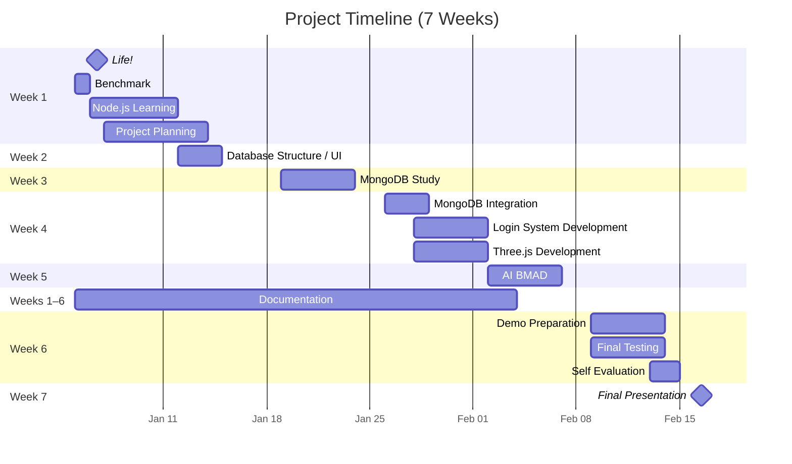

# 3Dcard - Project Plan

**Project Name:** 3Dcard - Social Icebreaker Game
**Author:** Petri
**Date:** February 2026
**Project Type:** Web Application (Full-Stack)
**Timeline:** --

---

## 1. Executive Summary

3Dcard is a web-based social icebreaker game designed to eliminate awkward silences when people meet for the first time. It is a full-featured web application with MongoDB authentication and persistent data storage.

The core feature is an interactive 3D western-style playing card that responds to mouse movement and flips to reveal conversation-starter questions. Users can manage their own collection of questions through full CRUD operations.

---

## 2. Project Objectives

### Primary Objectives

1. **Functional 3D Card Interface** - Implement an interactive 3D card using Three.js with smooth flip animation and mouse-tilt effect
2. **User Authentication** - Create secure user signup/login system with MongoDB
3. **Question Management** - Implement full CRUD operations for conversation questions
4. **Comprehensive Documentation** - Complete technical documentation with Mermaid diagrams

### Success Criteria

| Criterion | Measurement | Target |
|-----------|------------|--------|
| Functional 3D Card | Card flips smoothly, mouse-tilt works | 100% |
| MongoDB Connection | Stable database connection | 100% uptime |
| CRUD Operations | Create, Read, Update, Delete all work | All 4 operations |
| Code Quality | Clean, commented, MVC architecture | Meets standards |
| Documentation | Complete with Mermaid diagrams | All required docs |

---

## 3. Scope

### In Scope

**Full Application:**
- User authentication (signup/login/logout)
- MongoDB integration
- Question CRUD per user
- Session management
- MVC architecture

### Out of Scope

- Social sharing features
- Question categories
- Analytics/usage tracking
- User profiles beyond username/password
- Password reset email
- Admin dashboard
- Mobile native applications

---

## 4. Technology Stack

### Frontend

| Technology | Purpose |
|------------|---------|
| HTML5 | Page structure |
| CSS3 | Styling and responsive design |
| Vanilla JavaScript | Client-side logic |
| Three.js | 3D card rendering |

### Backend (Full App)

| Technology | Purpose |
|------------|---------|
| Node.js | JavaScript runtime |
| Express.js | Web framework |
| MongoDB | Database |
| Mongoose | ODM for MongoDB |
| EJS | Server-side templating |
| bcryptjs | Password hashing |
| express-session | Session management |

---

## 5. Architecture

### MVC Architecture

```
┌─────────────────────────────────────────────┐
│                 Browser                     │
│  (HTML, CSS, Three.js, Vanilla JS)         │
└─────────────────┬───────────────────────────┘
                  │ HTTP Requests
┌─────────────────▼───────────────────────────┐
│           Express Routes                    │
│  (Define endpoints, middleware)             │
└─────────────────┬───────────────────────────┘
                  │
┌─────────────────▼───────────────────────────┐
│          Controllers                        │
│  (Handle business logic, CRUD ops)          │
└─────┬───────────────────────┬───────────────┘
      │                       │
┌─────▼───────────┐   ┌───────▼──────────────┐
│   Models        │   │    Views (EJS)       │
│ (MongoDB Schemas)│   │  (Rendered HTML)     │
└─────┬───────────┘   └──────────────────────┘
      │
┌─────▼───────────┐
│   MongoDB       │
│   Database      │
└─────────────────┘
```

---

## 6. Database Design

### Collections

**Users Collection:**
```javascript
{
  _id: ObjectId,
  username: String (unique),
  password: String (hashed),
  createdAt: Date,
  updatedAt: Date
}
```

**Questions Collection:**
```javascript
{
  _id: ObjectId,
  text: String,
  createdBy: ObjectId (ref: User),
  createdAt: Date,
  updatedAt: Date
}
```

---

## 7. API Endpoints

| Method | Endpoint | Description | Auth |
|--------|----------|-------------|------|
| GET | `/` | Home page | No |
| GET/POST | `/signup` | User registration | No |
| GET/POST | `/login` | User login | No |
| GET | `/logout` | User logout | Yes |
| GET | `/questions` | Questions page | Yes |
| POST | `/questions` | Create question | Yes |
| PUT | `/questions/:id` | Update question | Yes |
| DELETE | `/questions/:id` | Delete question | Yes |
| GET | `/api/questions/random` | Random question API | Yes |
| GET | `/documentation` | Documentation page | No |

---

## 8. Development Timeline




---

## 9. Risk Assessment

| Risk | Impact | Probability | Mitigation |
|------|--------|-------------|------------|
| MongoDB connection issues | High | Medium | Use Atlas fallback, clear error messages |
| Three.js compatibility | Medium | Low | Test on multiple browsers, fallback to 2D |
| Time constraints | High | Medium | Prioritize core features, defer extras |
| Security vulnerabilities | High | Low | Use bcrypt, input validation, HTTPS |

---

## 10. Testing Strategy

### Unit Testing
- Model validation (User, Question schemas)
- Authentication functions
- CRUD operations

### Integration Testing
- MongoDB connection
- Session management
- API endpoints

### User Acceptance Testing
- Signup/login flow
- Question CRUD operations
- 3D card interaction
- Responsive design on mobile

---

## 11. Deployment

### Development Environment
```bash
npm run dev  # Uses nodemon for auto-reload
```

### Production Environment
```bash
npm start   # Standard Node.js execution
```

### Hosting Options
- **Full Application:** Heroku, Railway, Render, DigitalOcean

---

## 12. Maintenance & Future Enhancements

### Planned Enhancements
1. Question categories
2. Social sharing features
3. User profiles
4. Analytics dashboard
5. Mobile applications

### Maintenance
- Dependency updates
- Security patches
- Bug fixes
- Performance optimization

---


3Dcard is designed as a complete full-stack web application demonstrating modern JavaScript development practices with user authentication and persistent data storage.

All project objectives align with the requirements for achieving an A grade, including comprehensive documentation, MongoDB integration, MVC architecture, and responsive UI design.
