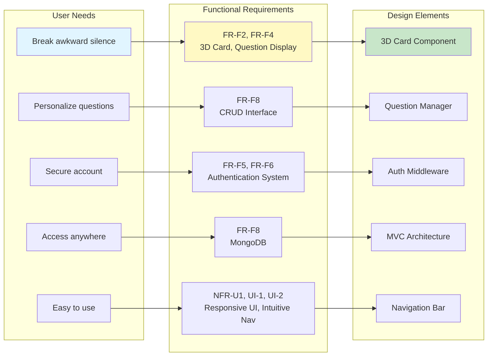

# 3Dcard - Requirements Specification

**Project:** 3Dcard - Social Icebreaker Game
**Version:** 1.0.0
**Author:** Petri
**Date:** February 2026

---

## 1. Introduction

### 1.1 Purpose

This document specifies the functional and non-functional requirements for the 3Dcard web application - a social icebreaker game designed to help people start conversations in awkward social situations.

### 1.2 Scope

The project is a complete web application with MongoDB authentication and persistent storage.

### 1.3 Definitions

- **CRUD:** Create, Read, Update, Delete operations
- **3D Card:** Interactive Three.js rendered playing card
- **MongoDB:** NoSQL database for data persistence
- **EJS:** Embedded JavaScript templating
- **MVC:** Model-View-Controller architecture pattern

---

## 2. Functional Requirements

```mermaid
graph TB
    subgraph "Application Requirements"
        FR-F1[FR-F1: 3D Card Display]
        FR-F2[FR-F2: Card Flip Animation]
        FR-F3[FR-F3: Mouse-Tilt Effect]
        FR-F4[FR-F4: Question Display]
        FR-F5[FR-F5: User Registration]
        FR-F6[FR-F6: User Login]
        FR-F7[FR-F7: User Logout]
        FR-F8[FR-F8: Question CRUD MongoDB]
        FR-F9[FR-F9: User Data Isolation]
        FR-F10[FR-F10: Default Questions]
        FR-F11[FR-F11: Navigation]
    end

    subgraph "Non-Functional Requirements"
        NFR-P[NFR-P: Performance]
        NFR-S[NFR-S: Security]
        NFR-U[NFR-U: Usability]
        NFR-M[NFR-M: Maintainability]
        NFR-C[NFR-C: Compatibility]
    end

    FR-D1 --> NFR-C
    FR-D2 --> NFR-P
    FR-F1 --> NFR-S
    FR-F4 --> NFR-M

    style FR-D1 fill:#e1f5ff
    style FR-D2 fill:#e1f5ff
    style FR-F1 fill:#ffe1e1
    style FR-F4 fill:#e1ffe1
    style NFR-S fill:#ffe1e1
```

### 2.1 Application Requirements

#### FR-F1: 3D Card Display
**Priority:** High
**Description:** The application shall display a 3D western-style playing card on the home page.
**Acceptance Criteria:**
- Card is rendered using Three.js
- Card maintains 2.5:3.5 aspect ratio
- Card displays in center of viewport
- Card has visual western/saloon theme

#### FR-F2: Card Flip Animation
**Priority:** High
**Description:** Users shall be able to click the card to flip it and reveal a question.
**Acceptance Criteria:**
- Single click initiates flip animation
- Animation completes within 600ms
- Card rotates 180 degrees smoothly
- Question text is visible on flip completion

#### FR-F3: Mouse-Tilt Effect
**Priority:** Medium
**Description:** The card shall respond to mouse movement with a subtle tilt effect.
**Acceptance Criteria:**
- Card tilts toward mouse cursor position
- Maximum tilt angle is 15 degrees
- Tilt updates smoothly with easing
- Tilt does not interfere with question readability

#### FR-F4: Question Display
**Priority:** High
**Description:** The application shall display conversation-starter questions on the card.
**Acceptance Criteria:**
- Questions render as text on card front
- Text supports word wrapping for long questions
- Default question set provided (10 questions)
- New question appears on each flip

#### FR-F1: User Registration
**Priority:** High
**Description:** Users shall be able to create a new account.
**Acceptance Criteria:**
- Signup form with username and password fields
- Username must be 3-30 characters, unique
- Password must be minimum 6 characters
- Password hashed before storage (bcrypt)
- Successful signup redirects to home page
- Error messages for invalid input

#### FR-F2: User Login
**Priority:** High
**Description:** Registered users shall be able to log in to their account.
**Acceptance Criteria:**
- Login form with username and password fields
- Validates credentials against database
- Creates session on successful login
- Redirects to home page on success
- Shows error message on failure

#### FR-F3: User Logout
**Priority:** High
**Description:** Logged-in users shall be able to log out.
**Acceptance Criteria:**
- Logout link accessible from navigation
- Destroys session on logout
- Redirects to home page
- Clears session cookies

#### FR-F4: Question CRUD (MongoDB)
**Priority:** High
**Description:** Users shall be able to manage persistent questions stored in MongoDB.
**Acceptance Criteria:**
- Create: Add new question to database
- Read: Retrieve user's questions only
- Update: Modify question text
- Delete: Remove question from database
- All operations verified for user ownership

#### FR-F5: User Data Isolation
**Priority:** High
**Description:** Users shall only see and manage their own questions.
**Acceptance Criteria:**
- Questions filtered by createdBy field
- Users cannot access other users' questions
- API validates user ownership on update/delete
- Session user ID matched to question owner

#### FR-F6: Default Questions
**Priority:** Medium
**Description:** New users shall receive a default set of questions.
**Acceptance Criteria:**
- 10 default questions created on first login
- Default questions are standard conversation starters
- Users can modify or delete defaults

---

## 3. Non-Functional Requirements

### 3.1 Performance

#### NFR-P1: Response Time
**Priority:** High
**Requirement:** API responses must complete within 500ms for local operations.
**Measurement:** Server response time

#### NFR-P2: Animation Frame Rate
**Priority:** High
**Requirement:** 3D card animation must maintain 60 FPS.
**Measurement:** Frames per second during animation

#### NFR-P3: Page Load Time
**Priority:** Medium
**Requirement:** Initial page load must complete within 3 seconds.
**Measurement:** Time from request to full render

### 3.2 Security

#### NFR-S1: Password Hashing
**Priority:** High
**Requirement:** Passwords must be hashed using bcrypt with salt rounds >= 10.
**Verification:** Code review, database inspection

#### NFR-S2: Session Management
**Priority:** High
**Requirement:** Sessions must use secure cookies with 24-hour expiration.
**Verification:** Cookie inspection, session testing

#### NFR-S3: Input Validation
**Priority:** High
**Requirement:** All user inputs must be sanitized and validated.
**Verification:** SQL injection testing, XSS testing

#### NFR-S4: Authentication
**Priority:** High
**Requirement:** Protected routes must require valid session.
**Verification:** Access control testing

### 3.3 Usability

#### NFR-U1: Responsive Design
**Priority:** High
**Requirement:** Application must work on desktop and mobile devices.
**Breakpoints:** Mobile (< 768px), Tablet (768px - 1024px), Desktop (> 1024px)

#### NFR-U2: Intuitive Navigation
**Priority:** Medium
**Requirement:** Users must be able to navigate the application without instructions.
**Verification:** User testing

#### NFR-U3: Error Messages
**Priority:** Medium
**Requirement:** All error states must display clear, actionable messages.
**Verification:** Error state testing

### 3.4 Maintainability

#### NFR-M1: Code Comments
**Priority:** Medium
**Requirement:** All functions must include descriptive comments.
**Verification:** Code review

#### NFR-M2: MVC Architecture
**Priority:** High
**Requirement:** Code must follow Model-View-Controller pattern.
**Verification:** Architecture review

#### NFR-M3: Error Handling
**Priority:** High
**Requirement:** All async operations must include proper error handling.
**Verification:** Error scenario testing

### 3.5 Compatibility

#### NFR-C1: Browser Support
**Priority:** High
**Requirement:** Application must work on Chrome 90+, Firefox 88+, Safari 14+, Edge 90+.
**Verification:** Cross-browser testing

#### NFR-C2: WebGL Support
**Priority:** High
**Requirement:** Application must detect WebGL support and provide fallback.
**Verification:** Browser capability testing

---

## 4. Data Requirements

### 4.1 User Data

| Field | Type | Constraints | Required |
|-------|------|-------------|----------|
| _id | ObjectId | Auto-generated | Yes |
| username | String | 3-30 chars, unique | Yes |
| password | String | Min 6 chars (hashed) | Yes |
| createdAt | Date | Auto-generated | Yes |
| updatedAt | Date | Auto-generated | Yes |

### 4.2 Question Data

| Field | Type | Constraints | Required |
|-------|------|-------------|----------|
| _id | ObjectId | Auto-generated | Yes |
| text | String | 5-500 chars | Yes |
| createdBy | ObjectId | Ref: User | Yes |
| createdAt | Date | Auto-generated | Yes |
| updatedAt | Date | Auto-generated | Yes |

---

## 5. Interface Requirements

### 5.1 User Interface

#### UI-1: Navigation Bar
- Fixed position at top of screen
- Dark blue background (#000c2a)
- Golden shadow effect
- Animated hamburger menu
- Responsive design

#### UI-2: 3D Card
- Centered on screen
- Western/saloon aesthetic
- Customizable front and back
- Smooth animations
- Subtle mouse-follow tilt

#### UI-3: Forms
- Clean, labeled inputs
- Validation feedback
- Error message display
- Submit and cancel buttons

### 5.2 API Interface

#### API-1: RESTful Conventions
- GET for retrieval
- POST for creation
- PUT for updates
- DELETE for removal
- JSON request/response format

#### API-2: Response Codes
- 200: Success
- 201: Created
- 400: Bad Request
- 401: Unauthorized
- 403: Forbidden
- 404: Not Found
- 500: Server Error

---

## 6. Business Rules

### BR-1: Username Uniqueness
Each username must be unique across the system. Duplicate usernames are rejected.

### BR-2: Question Ownership
Users can only CRUD their own questions. Cross-user access is prohibited.

### BR-3: Session Expiration
User sessions expire after 24 hours of inactivity.

### BR-4: Default Questions
New users receive 10 default questions on account creation.

---

## 7. Verification Matrix

| Requirement | Verification Method | Status |
|-------------|-------------------|--------|
| FR-D1: 3D Card Display | Visual inspection | ✅ |
| FR-D2: Card Flip | Functional testing | ✅ |
| FR-D3: Mouse-Tilt | Functional testing | ✅ |
| FR-D4: Question Display | Visual inspection | ✅ |
| FR-D5: Question CRUD (Browser) | Functional testing | ✅ |
| FR-D6: Navigation | Functional testing | ✅ |
| FR-D7: Documentation | Content review | ✅ |
| FR-F1: User Registration | Functional testing | ✅ |
| FR-F2: User Login | Functional testing | ✅ |
| FR-F3: User Logout | Functional testing | ✅ |
| FR-F4: Question CRUD (MongoDB) | Functional testing | ✅ |
| FR-F5: User Isolation | Security testing | ✅ |
| FR-F6: Default Questions | Functional testing | ✅ |

---

## 8. Traceability

| User Need | Functional Requirement | Design Element |
|-----------|----------------------|---------------|
| Break awkward silence | FR-F2, FR-F4 | 3D Card, Question display |
| Personalize questions | FR-F8 | CRUD interface |
| Secure account | FR-F5, FR-F6, NFR-S1 | Authentication system |
| Access anywhere | FR-F8 | MongoDB |
| Easy to use | NFR-U1, UI-1, UI-2 | Responsive UI, Intuitive nav |

---

## 9. Change History

| Version | Date | Changes | Author |
|---------|------|---------|--------|
| 1.0.0 | 2026-02-02 | Initial requirements specification | Petri |
