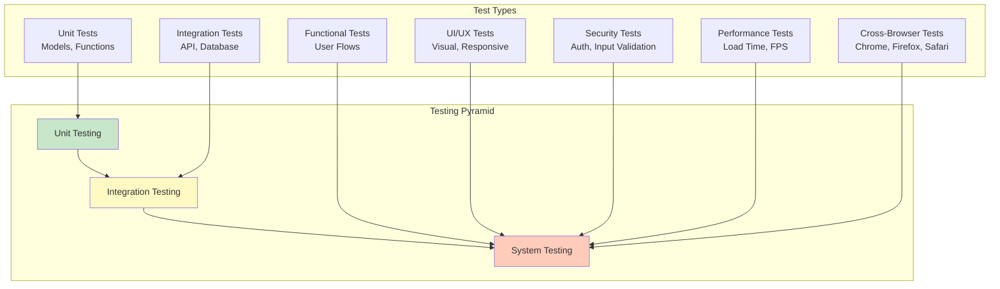
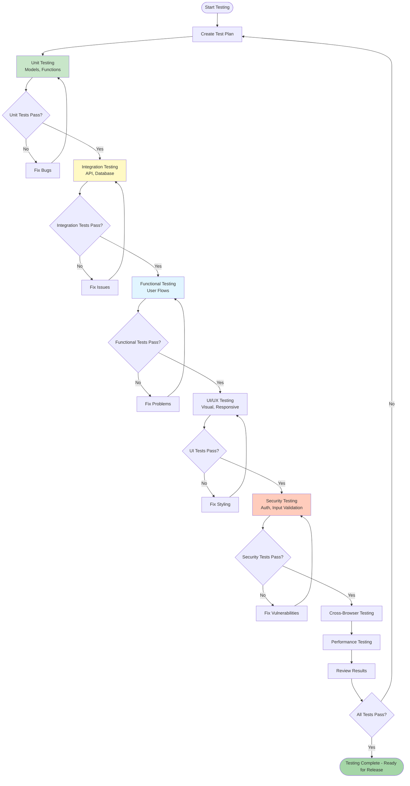

# 3Dcard - Test Plan

**Project:** 3Dcard - Social Icebreaker Game
**Version:** 1.0.0
**Author:** Petri
**Date:** February 2026

---

## 1. Introduction

### 1.1 Purpose

This document outlines the testing strategy for the 3Dcard web application.

### 1.2 Scope

**In Scope:**
- Functional testing of all features
- UI/UX testing
- Database testing
- Security testing
- Performance testing
- Cross-browser compatibility
- Responsive design testing

**Out of Scope:**
- Load testing (beyond basic performance)
- Automated end-to-end testing
- Accessibility auditing (basic checks only)

---

## 2. Test Strategy



### 2.1 Testing Levels

```
┌─────────────────────────────────────────────────────┐
│                  SYSTEM TESTING                      │
│  ┌───────────────────────────────────────────────┐  │
│             INTEGRATION TESTING                    │  │
│  ┌─────────────────────────────────────────────┐  │  │
│               UNIT TESTING                        │  │  │
│  │  Functions, Models, Components               │  │  │
│  └─────────────────────────────────────────────┘  │  │
│  └───────────────────────────────────────────────┘  │
└─────────────────────────────────────────────────────┘
```

### 2.2 Testing Approach

| Test Type | Manual | Automated | Tools |
|-----------|--------|-----------|-------|
| Unit Testing | | ✅ | Jest/Mocha |
| Integration Testing | | ✅ | Supertest |
| Functional Testing | ✅ | | Browser |
| UI/UX Testing | ✅ | | Browser, DevTools |
| Security Testing | ✅ | | Manual review |
| Performance Testing | ✅ | | Chrome DevTools |
| Cross-Browser Testing | ✅ | | Multiple browsers |

---

## 3. Unit Testing

### 3.1 Test Cases - User Model

```javascript
// Test Suite: User Model

Test Case: UM-001 - Create User with Valid Data
Input: { username: "testuser", password: "password123" }
Expected: User created successfully
Verification: User saved to database, password hashed

Test Case: UM-002 - Create User with Duplicate Username
Input: { username: "existinguser", password: "password123" }
Expected: Error thrown
Verification: Duplicate key error returned

Test Case: UM-003 - Create User with Short Password
Input: { username: "testuser", password: "12345" }
Expected: Validation error
Verification: Error message about minimum length

Test Case: UM-004 - Compare Password - Correct
Input: User with hashed password, candidatePassword
Expected: Returns true
Verification: comparePassword() returns true

Test Case: UM-005 - Compare Password - Incorrect
Input: User with hashed password, wrongPassword
Expected: Returns false
Verification: comparePassword() returns false
```

### 3.2 Test Cases - Question Model

```javascript
// Test Suite: Question Model

Test Case: QM-001 - Create Question with Valid Data
Input: { text: "What is your favorite color?", createdBy: userId }
Expected: Question created successfully
Verification: Question saved with all fields

Test Case: QM-002 - Create Question with Short Text
Input: { text: "Hi?", createdBy: userId }
Expected: Validation error
Verification: Error about minimum length

Test Case: QM-003 - Create Question with Long Text
Input: { text: "A".repeat(501), createdBy: userId }
Expected: Validation error
Verification: Error about maximum length

Test Case: QM-004 - Question Timestamps
Input: Create question
Expected: createdAt and updatedAt set
Verification: Both dates are ISODate objects
```

### 3.3 Test Cases - Authentication

```javascript
// Test Suite: Authentication Functions

Test Case: AF-001 - Hash Password
Input: "plaintextPassword"
Expected: Returns hash string
Verification: Hash != input, hash length = 60

Test Case: AF-002 - Generate Salt
Input: None (internal function)
Expected: Returns random salt
Verification: Different salts on multiple calls

Test Case: AF-003 - Create Session
Input: User object
Expected: Session created with user data
Verification: req.session.user exists
```

---

## 4. Integration Testing

### 4.1 Test Cases - API Endpoints

```javascript
// Test Suite: API Integration

Test Case: AI-001 - POST /signup - Valid User
Request: { username: "newuser", password: "pass123" }
Expected: 302 Redirect to /
Verification: User created in DB, session set

Test Case: AI-002 - POST /signup - Duplicate Username
Request: { username: "existing", password: "pass123" }
Expected: 200 with error message
Verification: No new user created

Test Case: AI-003 - POST /login - Valid Credentials
Request: { username: "testuser", password: "password" }
Expected: 302 Redirect to /
Verification: Session created

Test Case: AI-004 - POST /login - Invalid Password
Request: { username: "testuser", password: "wrong" }
Expected: 200 with error message
Verification: No session created

Test Case: AI-005 - GET /logout - Logged In
Request: Session exists
Expected: 302 Redirect to /
Verification: Session destroyed

Test Case: AI-006 - GET /questions - Without Login
Request: No session
Expected: 302 Redirect to /login
Verification: Cannot access questions page

Test Case: AI-007 - POST /questions - Valid
Request: { text: "Test question?" }, session exists
Expected: 302 Redirect to /questions
Verification: Question created with correct createdBy

Test Case: AI-008 - PUT /questions/:id - Own Question
Request: { text: "Updated?" }, own question ID, session exists
Expected: 302 Redirect to /questions
Verification: Question updated

Test Case: AI-009 - PUT /questions/:id - Other's Question
Request: { text: "Hacked?" }, other's question ID
Expected: 404 Not Found
Verification: Question not updated

Test Case: AI-010 - DELETE /questions/:id - Own Question
Request: own question ID, session exists
Expected: 302 Redirect to /questions
Verification: Question deleted

Test Case: AI-011 - GET /api/questions/random
Request: Session exists
Expected: 200 with JSON { _id, text }
Verification: Returns random user question
```

### 4.2 Test Cases - Database Integration

```javascript
// Test Suite: Database Integration

Test Case: DI-001 - MongoDB Connection
Action: Start server
Expected: "MongoDB connected" message
Verification: No connection errors

Test Case: DI-002 - Create User in DB
Action: POST /signup
Expected: User appears in users collection
Verification: db.users.findOne({ username })

Test Case: DI-003 - Cascade Delete Questions
Action: Delete user
Expected: All user's questions deleted (optional feature)
Verification: Count questions before/after

Test Case: DI-004 - Session Storage
Action: Login, check session store
Expected: Session data persisted
Verification: Session contains user._id
```

---

## 5. Functional Testing

### 5.1 Functional Test Cases

| ID | Test Case | Steps | Expected Result |
|----|-----------|-------|-----------------|
| F-001 | View 3D Card | Visit / | Card displays centered |
| F-002 | Card Mouse-Tilt | Move mouse over card | Card tilts toward mouse |
| F-003 | Card Flip | Click card | Card flips 180° smoothly |
| F-004 | Question Display | Flip card | Question text visible |
| F-005 | New Question | Click again | Different question appears |
| F-006 | Navigation - Home | Click Home link | Home section shows |
| F-007 | Navigation - Questions | Click Questions link | Questions page shows |
| F-008 | Add Question | Enter text, click Add | Question appears in list |
| F-009 | Edit Question | Click Edit, modify, Save | Question updated |
| F-010 | Delete Question | Click Delete, confirm | Question removed |
| F-011 | Question Persistence | Refresh page | Questions still in list |
| F-012 | Mobile Menu | Resize < 768px, click menu | Hamburger menu expands |
| F-013 | Home Page (Not Logged In) | Visit / | Welcome message + signup/login |
| F-014 | Home Page (Logged In) | Visit / with session | 3D card + nav changes |
| F-015 | Sign Up - Valid | Enter valid username/password | Account created, redirected |
| F-016 | Sign Up - Short Password | Enter password < 6 chars | Error message |
| F-017 | Sign Up - Duplicate | Use existing username | Error: username exists |
| F-018 | Login - Valid | Enter correct credentials | Redirected to / |
| F-019 | Login - Invalid | Enter wrong password | Error message |
| F-020 | Login - Non-existent | Enter unknown username | Error message |
| F-021 | Logout | Click Logout link | Redirected to /, session gone |
| F-022 | Protected Route - No Session | Visit /questions directly | Redirected to /login |
| F-023 | Add Question | POST valid question with session | Question saved to MongoDB |
| F-024 | User Isolation | Create account, add question | Only shows own questions |
| F-025 | Edit Own Question | PUT to own question ID | Updates successfully |
| F-026 | Edit Other's Question | PUT to different user's question | Returns 404 |
| F-027 | Delete Own Question | DELETE own question ID | Deleted successfully |
| F-028 | Default Questions | New user first login | 10 default questions created |
| F-029 | Random Question API | GET /api/questions/random | Returns user's random question |

---

## 6. UI/UX Testing

### 6.1 Visual Testing

```javascript
// Test Suite: Visual Design

Test Case: VU-001 - Navigation Bar Position
Check: Nav bar fixed at top
Viewport: Desktop (1920x1080)
Expected: Nav bar at top, full width (80vw max)

Test Case: VU-002 - Mobile Navigation
Check: Hamburger menu appears
Viewport: Mobile (375x667)
Expected: Collapsed menu, hamburger icon

Test Case: VU-003 - Card Centering
Check: Card position on screen
Viewport: Various
Expected: Card centered vertically and horizontally

Test Case: VU-004 - Card Text Readability
Check: Question text on card
Condition: Card flipped
Expected: Text readable, good contrast

Test Case: VU-005 - Button Styling
Check: All buttons
Expected: Consistent styling, hover effects

Test Case: VU-006 - Form Labels
Check: All form inputs
Expected: Labels present, associated correctly

Test Case: VU-007 - Error Messages
Check: Error display
Expected: Red/burgundy background, white text
```

### 6.2 Responsive Design Testing

| Breakpoint | Width | Test Cases |
|------------|-------|------------|
| Mobile | 375px | Nav collapses, card scales, forms full width |
| Tablet | 768px | Nav expands, card centered, questions list 2-col |
| Desktop | 1920px | Full layout, nav horizontal, card optimal size |

### 6.3 Accessibility Testing (Basic)

```javascript
// Test Suite: Basic Accessibility

Test Case: AC-001 - Keyboard Navigation
Action: Tab through interface
Expected: Logical tab order, visible focus

Test Case: AC-002 - Form Labels
Action: Check all forms
Expected: Labels associated via 'for' attribute

Test Case: AC-003 - Color Contrast
Action: Check text/background
Expected: Minimum 4.5:1 contrast ratio (WCAG AA)

Test Case: AC-004 - Alt Text
Action: Check images
Expected: Meaningful alt text provided
```

---

## 7. Security Testing

### 7.1 Authentication Security

| ID | Test Case | Procedure | Expected |
|----|-----------|-----------|----------|
| SC-001 | Password Hashing | Check database for stored passwords | All hashed (bcrypt) |
| SC-002 | Session Hijacking | Attempt to access without session | Redirected to login |
| SC-003 | Session Expiration | Wait 24 hours, try to access | Session invalid |
| SC-004 | Route Protection | Access /questions without login | Redirected to /login |

### 7.2 Input Validation Security

| ID | Test Case | Input | Expected |
|----|-----------|-------|----------|
| SV-001 | SQL Injection | Username: "' OR '1'='1" | Treated as literal string |
| SV-002 | XSS Attack | Question text with <script> | Sanitized/escaped |
| SV-003 | CSRF Attack | POST from external site | CSRF token required (future) |
| SV-004 | Username Validation | Special characters | Validation error or sanitized |

### 7.3 Authorization Testing

```javascript
// Test Suite: User Isolation

Test Case: AU-001 - Cross-User Question Access
Action: User A tries to access User B's question
Method: GET /questions with User B's question ID
Expected: 404 Not Found (user owns check)

Test Case: AU-002 - Cross-User Question Update
Action: User A tries to update User B's question
Method: PUT /questions/:id with User B's ID
Expected: 404 Not Found

Test Case: AU-003 - Cross-User Question Delete
Action: User A tries to delete User B's question
Method: DELETE /questions/:id with User B's ID
Expected: 404 Not Found
```

---

## 8. Performance Testing

### 8.1 Load Time Testing

| Resource | Target | Measurement |
|----------|--------|-------------|
| Initial Page Load | < 3 seconds | DevTools Network tab |
| Time to Interactive | < 5 seconds | Lighthouse |
| First Contentful Paint | < 1.5 seconds | Lighthouse |
| Card Animation FPS | 60 FPS | Chrome DevTools Performance |

### 8.2 Database Query Performance

```javascript
// Test Suite: Query Performance

Test Case: DP-001 - User Lookup
Query: User.findOne({ username })
Expected: < 50ms (indexed)

Test Case: DP-002 - User Questions List
Query: Question.find({ createdBy: userId })
Expected: < 100ms for 100 questions (indexed)

Test Case: DP-003 - Random Question
Query: Aggregation with $sample
Expected: < 100ms
```

---

## 9. Cross-Browser Testing

### 9.1 Browser Compatibility Matrix

| Browser | Version | 3D Card | Forms | Auth | CRUD | Notes |
|---------|---------|---------|-------|------|------|-------|
| Chrome | 90+ | ✅ | ✅ | ✅ | ✅ | Primary target |
| Firefox | 88+ | ✅ | ✅ | ✅ | ✅ | Full support |
| Safari | 14+ | ✅ | ✅ | ✅ | ✅ | WebGL enabled |
| Edge | 90+ | ✅ | ✅ | ✅ | ✅ | Chromium-based |

### 9.2 Test Cases Per Browser

| ID | Test Case | Browsers |
|----|-----------|----------|
| CB-001 | Card flip animation | All |
| CB-002 | Mouse-tilt effect | All |
| CB-003 | Form submission | All |
| CB-004 | Session management | All |
| CB-005 | Session management | All |

---

## 10. Test Execution



### 10.1 Test Schedule

| Phase | Duration | Tests |
|-------|----------|-------|
| Day 1 | 2 hours | Unit tests (models) |
| Day 2 | 2 hours | Integration tests (API) |
| Day 3 | 2 hours | Functional tests (manual) |
| Day 4 | 2 hours | UI/UX, security tests |
| Day 5 | 2 hours | Cross-browser, performance |

### 10.2 Test Environment

**Development Environment:**
- Node.js v18+
- MongoDB v6.0+
- Chrome DevTools

**Browsers for Testing:**
- Chrome (latest)
- Firefox (latest)
- Safari (latest macOS/iOS)
- Edge (latest Windows)

### 10.3 Test Data

```javascript
// Test Users
{ username: "testuser1", password: "test123" }
{ username: "testuser2", password: "test456" }

// Test Questions
[
  "What is your favorite color?",
  "If you could travel anywhere, where?",
  "What's your favorite movie?",
  ... (10 total)
]
```

---

## 11. Bug Reporting

### 11.1 Bug Report Template

```markdown
## Bug Report

**ID:** BUG-XXX
**Title:** Brief description
**Severity:** Critical/High/Medium/Low
**Environment:** OS, Browser, Version

### Steps to Reproduce
1. Step one
2. Step two
3. Step three

### Expected Behavior
What should happen

### Actual Behavior
What actually happens

### Screenshots
[Attach if applicable]

### Additional Info
Logs, error messages, etc.
```

### 11.2 Severity Levels

| Severity | Definition | Example |
|----------|------------|---------|
| Critical | App unusable, data loss | Can't log in, data deleted |
| High | Major feature broken | CRUD doesn't work |
| Medium | Minor feature broken | Styling issue, typo |
| Low | Cosmetic issue | Font size, color |

---

## 12. Test Results Summary

### 12.1 Test Metrics

| Metric | Target | Actual |
|--------|--------|--------|
| Test Coverage | > 80% | TBD |
| Pass Rate | > 95% | TBD |
| Critical Bugs | 0 | TBD |
| High Bugs | < 3 | TBD |

### 12.2 Sign-Off Criteria

The application is ready for submission when:

- ✅ All functional tests pass
- ✅ No critical bugs
- ✅ MongoDB connection stable
- ✅ Authentication working
- ✅ CRUD operations working
- ✅ Cross-browser compatible
- ✅ Responsive design verified
- ✅ Documentation complete

---

## 13. Conclusion

This test plan provides comprehensive coverage of the 3Dcard application, ensuring all functional requirements are met and the application performs reliably across different environments and use cases.

Testing is an ongoing process, and this plan should be updated as new features are added or issues are discovered.
