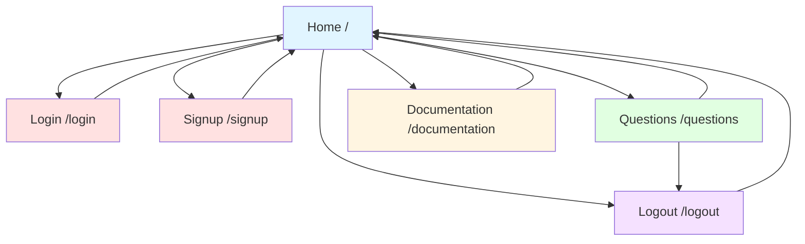
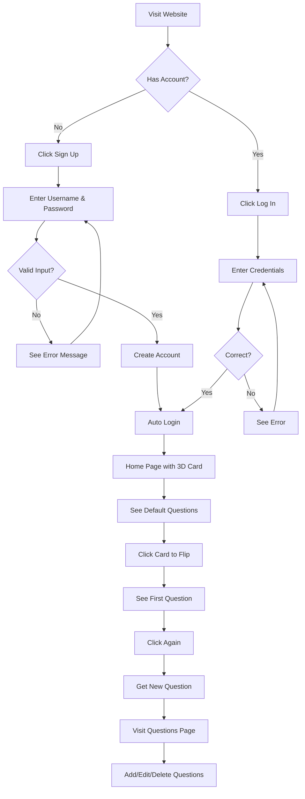
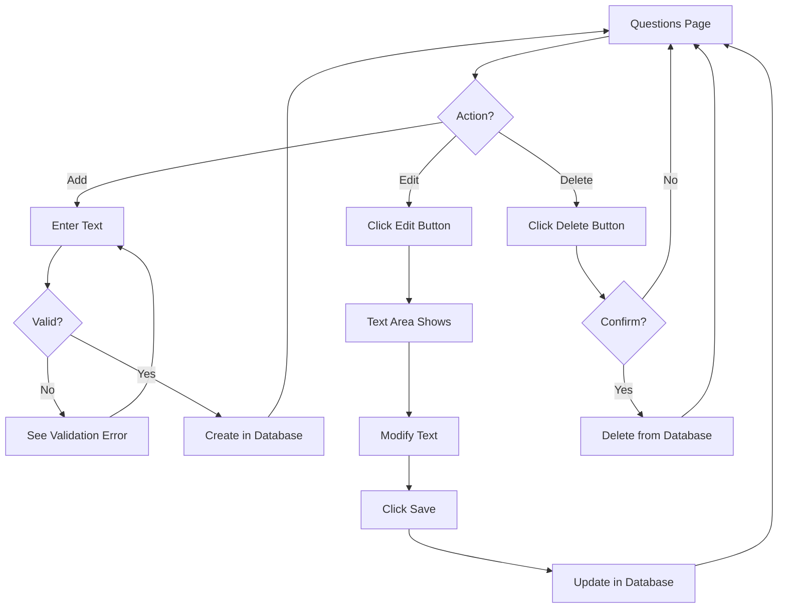

# 3Dcard - Wireframes and Site Map

**Project:** 3Dcard - Social Icebreaker Game
**Version:** 1.0.0
**Author:** Petri
**Date:** February 2026

---

## 1. Site Map



**Page Descriptions:**

| Page | URL | Access | Description |
|------|-----|--------|-------------|
| Home | `/` | Public / Auth Required | Main page with 3D card |
| Login | `/login` | Public | User login form |
| Signup | `/signup` | Public | User registration form |
| Questions | `/questions` | Auth Required | Question CRUD management |
| Documentation | `/documentation` | Public | Project documentation |
| Logout | `/logout` | Auth Required | Ends session, redirects home |

---

## 2. Wireframes

### 2.1 Home Page (Not Logged In - Full App Only)

```
┌────────────────────────────────────────────────────────────┐
│  [☰] 3Dcard                                              │
│       Home    Log in    Sign up    Documentation           │
└────────────────────────────────────────────────────────────┘

┌────────────────────────────────────────────────────────────┐
│                                                            │
│                    ╔═══════════════╗                         │
│                    ║               ║                         │
│                    ║   WELCOME TO   ║                         │
│                    ║     3Dcard     ║                         │
│                    ║               ║                         │
│                    ║  Social Icebreak│                         │
│                    ║       er Game  ║                         │
│                    ║               ║                         │
│                    ╚═══════════════╝                         │
│                                                            │
│              The interactive 3D card that helps             │
│              you start conversations in style.             │
│                                                            │
│                                                            │
│   ┌─────────────────┐       ┌─────────────────┐           │
│   │                 │       │                 │           │
│   │    SIGN UP      │       │     LOG IN      │           │
│   │                 │       │                 │           │
│   └─────────────────┘       └─────────────────┘           │
│                                                            │
└────────────────────────────────────────────────────────────┘
```

### 2.2 Home Page (Logged In - With 3D Card)

```
┌────────────────────────────────────────────────────────────┐
│  [☰] 3Dcard                                              │
│       Home    Questions    Log out    Documentation        │
└────────────────────────────────────────────────────────────┘

┌────────────────────────────────────────────────────────────┐
│                                                            │
│                    ╱───────╲                               │
│                   │         │                              │
│                  │    3D    │   ← Card subtly tilts toward   │
│                   │   CARD   │     mouse cursor             │
│                  │         │                              │
│                   ╲───────╱                               │
│                                                            │
│              (Click card to flip for question)             │
│                                                            │
└────────────────────────────────────────────────────────────┘

                    (Card flipped - Question visible)

┌────────────────────────────────────────────────────────────┐
│                                                            │
│                    ╔═══════════════╗                         │
│                    ║ ┌─────────┐ ║                         │
│                    ║ │  WHAT   │ ║                         │
│                    ║ │  IS YOUR │ ║                         │
│                    ║ │FAVORITE │ ║                         │
│                    ║ │  COLOR? │ ║                         │
│                    ║ └─────────┘ ║                         │
│                    ║             ║                         │
│                    ║  (Western    │                         │
│                    ║   card art) │                         │
│                    ╚═══════════════╝                         │
│                                                            │
│              Click card for new question                   │
│                                                            │
└────────────────────────────────────────────────────────────┘
```

### 2.3 Login Page

```
┌────────────────────────────────────────────────────────────┐
│  [☰] 3Dcard                                              │
│       Home    Log in    Sign up    Documentation           │
└────────────────────────────────────────────────────────────┘

┌────────────────────────────────────────────────────────────┐
│                                                            │
│                    ╔═══════════════╗                         │
│                    ║               ║                         │
│                    ║    LOG IN     ║                         │
│                    ║               ║                         │
│                    ╚═══════════════╝                         │
│                                                            │
│  ┌─────────────────────────────────────────────────┐     │
│  │                                                 │     │
│  │  Username:                                      │     │
│  │  ┌─────────────────────────────────────────┐   │     │
│  │  │                                         │   │     │
│  │  └─────────────────────────────────────────┘   │     │
│  │                                                 │     │
│  │  Password:                                      │     │
│  │  ┌─────────────────────────────────────────┐   │     │
│  │  │ •••••••••••••••                         │   │     │
│  │  └─────────────────────────────────────────┘   │     │
│  │                                                 │     │
│  │           ┌─────────────┐                      │     │
│  │           │   LOG IN    │                      │     │
│  │           └─────────────┘                      │     │
│  │                                                 │     │
│  └─────────────────────────────────────────────────┘     │
│                                                            │
│              Don't have an account? Sign up               │
│                                                            │
└────────────────────────────────────────────────────────────┘
```

### 2.4 Signup Page

```
┌────────────────────────────────────────────────────────────┐
│  [☰] 3Dcard                                              │
│       Home    Log in    Sign up    Documentation           │
└────────────────────────────────────────────────────────────┘

┌────────────────────────────────────────────────────────────┐
│                                                            │
│                    ╔═══════════════╗                         │
│                    ║               ║                         │
│                    ║   SIGN UP     ║                         │
│                    ║               ║                         │
│                    ╚═══════════════╝                         │
│                                                            │
│  ┌─────────────────────────────────────────────────┐     │
│  │                                                 │     │
│  │  Username:                                      │     │
│  │  ┌─────────────────────────────────────────┐   │     │
│  │  │ Enter username (3-30 characters)         │   │     │
│  │  └─────────────────────────────────────────┘   │     │
│  │                                                 │     │
│  │  Password:                                      │     │
│  │  ┌─────────────────────────────────────────┐   │     │
│  │  │ ••••••••••••••• (min 6 characters)       │   │     │
│  │  └─────────────────────────────────────────┘   │     │
│  │                                                 │     │
│  │           ┌─────────────┐                      │     │
│  │           │   SIGN UP   │                      │     │
│  │           └─────────────┘                      │     │
│  │                                                 │     │
│  └─────────────────────────────────────────────────┘     │
│                                                            │
│               Already have an account? Log in              │
│                                                            │
└────────────────────────────────────────────────────────────┘
```

### 2.5 Questions Page (CRUD)

```
┌────────────────────────────────────────────────────────────┐
│  [☰] 3Dcard                                              │
│       Home    Questions    Log out    Documentation        │
└────────────────────────────────────────────────────────────┘

┌────────────────────────────────────────────────────────────┐
│                                                            │
│                    ╔═══════════════╗                         │
│                    ║               ║                         │
│                    ║   MY QUESTIONS ║                         │
│                    ║               ║                         │
│                    ╚═══════════════╝                         │
│                                                            │
│  ┌─────────────────────────────────────────────────┐     │
│  │  ╔═════════════════════════════════════════════╗   │     │
│  │  ║  Add New Question                              ║   │     │
│  │  ║  ┌─────────────────────────────────────────┐ ║   │     │
│  │  ║  │ Enter your icebreaker question...        │ ║   │     │
│  │  ║  │                                         │ ║   │     │
│  │  ║  │                                         │ ║   │     │
│  │  ║  └─────────────────────────────────────────┘ ║   │     │
│  │  ║  ┌──────────┐                                 ║   │     │
│  │  ║  │   ADD    │                                 ║   │     │
│  │  ║  └──────────┘                                 ║   │     │
│  │  ╚═════════════════════════════════════════════╝   │     │
│  └─────────────────────────────────────────────────┘     │
│                                                            │
│  Your Questions:                                          │
│                                                            │
│  ┌─────────────────────────────────────────────────┐     │
│  │  What is your favorite color?                    │     │
│  │                               [Edit]  [Delete]    │     │
│  ├─────────────────────────────────────────────────┤     │
│  │  If you could travel anywhere, where?            │     │
│  │                               [Edit]  [Delete]    │     │
│  ├─────────────────────────────────────────────────┤     │
│  │  What's the best advice you've ever received?    │     │
│  │                               [Edit]  [Delete]    │     │
│  └─────────────────────────────────────────────────┘     │
│                                                            │
└────────────────────────────────────────────────────────────┘
```

### 2.6 Questions Page (Edit Mode)

```
┌────────────────────────────────────────────────────────────┐
│  [☰] 3Dcard                                              │
│       Home    Questions    Log out    Documentation        │
└────────────────────────────────────────────────────────────┘

┌────────────────────────────────────────────────────────────┐
│                                                            │
│  Your Questions:                                          │
│                                                            │
│  ┌─────────────────────────────────────────────────┐     │
│  │  What is your favorite color?                    │     │
│  │                               [Edit]  [Delete]    │     │
│  ├─────────────────────────────────────────────────┤     │
│  │  ┌─────────────────────────────────────────┐     │     │
│  │  │ If you could travel anywhere...?         │     │     │
│  │  └─────────────────────────────────────────┘     │     │
│  │                      [Save] [Cancel]             │     │
│  ├─────────────────────────────────────────────────┤     │
│  │  What's the best advice you've ever received?    │     │
│  │                               [Edit]  [Delete]    │     │
│  └─────────────────────────────────────────────────┘     │
│                                                            │
└────────────────────────────────────────────────────────────┘
```

### 2.7 Documentation Page

```
┌────────────────────────────────────────────────────────────┐
│  [☰] 3Dcard                                              │
│       Home    [Log in]    [Sign up]    Documentation       │
└────────────────────────────────────────────────────────────┘

┌────────────────────────────────────────────────────────────┐
│                                                            │
│                    ╔═══════════════╗                         │
│                    ║               ║                         │
│                    ║ DOCUMENTATION ║                         │
│                    ║               ║                         │
│                    ╚═══════════════╝                         │
│                                                            │
│  Table of Contents:                                        │
│  • Overview                                               │
│  • Features                                               │
│  • How to Use                                             │
│  • Customization                                          │
│  • Technical Details                                      │
│  • API Endpoints                                          │
│  • Setup Instructions                                     │
│                                                            │
│  Overview                                                  │
│  ═══════════                                               │
│  3Dcard is a web-based social icebreaker game...          │
│                                                            │
│  Features                                                  │
│  ═══════════                                               │
│  • Interactive 3D Card...                                  │
│  • Question Management...                                  │
│                                                            │
│  [Scroll for more...]                                      │
│                                                            │
└────────────────────────────────────────────────────────────┘
```

---

## 3. Mobile Wireframes

### 3.1 Mobile Home (Logged Out - Full App)

```
┌──────────────────┐
│  [☰]    3Dcard  │  ← Nav bar, full width
└──────────────────┘

┌──────────────────┐
│                  │
│    ╔═════════╗   │
│    ║         ║   │
│    ║ WELCOME │   │
│    ║  TO    ║   │
│    ║ 3Dcard ║   │
│    ║         ║   │
│    ╚═════════╝   │
│                  │
│  The interactive │
│  3D card that    │
│  helps you start │
│  conversations  │
│                  │
│  ┌──────────┐    │
│  │ SIGN UP  │    │
│  └──────────┘    │
│                  │
│  ┌──────────┐    │
│  │  LOG IN  │    │
│  └──────────┘    │
│                  │
└──────────────────┘
```

### 3.2 Mobile Home (Logged In - With Card)

```
┌──────────────────┐
│  [☰]    3Dcard  │
│   Questions   ↓  │  ← Expanded menu
└──────────────────┘

┌──────────────────┐
│                  │
│      ╱───╲       │
│     │     │      │
│     │ 3D  │      │
│     │ CARD │     │
│     │     │      │
│      ╲───╱       │
│                  │
│   (Tilt effect)  │
│                  │
│  Click to flip   │
│                  │
└──────────────────┘
```

### 3.3 Mobile Questions Page

```
┌──────────────────┐
│  [←]  Questions  │
└──────────────────┘

┌──────────────────┐
│   MY QUESTIONS   │
├──────────────────┤
│                  │
│  ┌────────────┐  │
│  │ Add New    │  │
│  │ Question   │  │
│  └────────────┘  │
│                  │
│  ┌──────────────┐│
│  │ What is your ││
│  │ favorite...  ││
│  │              ││
│  │ [E] [D]      ││
│  └──────────────┘│
│                  │
│  ┌──────────────┐│
│  │ If you could ││
│  │ travel...   ││
│  │              ││
│  │ [E] [D]      ││
│  └──────────────┘│
│                  │
└──────────────────┘
```

### 3.4 Mobile Navigation Menu

```
Collapsed state:

┌──────────────────┐
│  [☰]    3Dcard  │
│       Home   ↓   │
└──────────────────┘

Expanded state:

┌──────────────────┐
│  [✕]            │
├──────────────────┤
│  > Home          │
│  > Questions     │
│  > Log out       │
│  > Documentation │
└──────────────────┘
```

---

## 4. Component Wireframes

### 4.1 Navigation Bar Component

**Desktop (> 768px):**

```
┌────────────────────────────────────────────────────────┐
│ [≡]           Home    Questions    Login    Docs     │
│       └──────────────────┴─────────────┴───────┘    │
└────────────────────────────────────────────────────────┘
  ↑       ↑─────────────────────────────────────────↑
icon    Links (horizontal, spaced)              aligned right
```

**Mobile (< 768px):**

```
┌──────────────────────┐
│ [≡]      3Dcard    │
└──────────────────────┘

Tapping [≡] expands:

┌──────────────────────┐
│ [✕]                 │
├──────────────────────┤
│  Home                │
│  Questions           │
│  Log in / Sign up    │
│  Documentation       │
└──────────────────────┘
```

### 4.2 3D Card Component

**Idle State:**
```
      ┌─────────┐
     ╱│         │╲
    │ │   3D    │  │ ← Subtle tilt toward mouse
    │ │  CARD   │  │
     ╲│         │╱
      └─────────┘
```

**Flipped State (showing question):**
```
      ┌─────────┐
     ╱│         │╲
    │ │ What is │  │
    │ │ your    │  │ ← Western themed card
    │ │favorite │  │    with parchment background
     ╲│  color? │╱
      └─────────┘
```

### 4.3 Question Item Component

**Display Mode:**
```
┌─────────────────────────────────────────────────┐
│ What is your favorite color?         [Edit] [Delete]│
└─────────────────────────────────────────────────┘
```

**Edit Mode:**
```
┌─────────────────────────────────────────────────┐
│ ┌─────────────────────────────────┐              │
│ │ If you could travel anywhere,  │              │
│ │ where would you go?            │  [Save] [Cancel]
│ └─────────────────────────────────┘              │
└─────────────────────────────────────────────────┘
```

### 4.4 Form Component (Login/Signup)

```
┌─────────────────────────────────────────────────┐
│                  ╔═════════════╗                  │
│                  ║    LOG IN    ║                  │
│                  ╚═════════════╝                  │
│                                                 │
│  Username:                                     │
│  ┌─────────────────────────────────────┐       │
│  │                                     │       │
│  └─────────────────────────────────────┘       │
│                                                 │
│  Password:                                     │
│  ┌─────────────────────────────────────┐       │
│  │ ••••••••••••                         │       │
│  └─────────────────────────────────────┘       │
│                                                 │
│              ┌───────────┐                     │
│              │   LOG IN  │                     │
│              └───────────┘                     │
│                                                 │
│           Don't have an account? Sign up        │
└─────────────────────────────────────────────────┘
```

### 4.5 Add Question Form Component

```
┌─────────────────────────────────────────────────┐
│  ╔═══════════════════════════════════════════╗   │
│  ║  Add New Question                            ║   │
│  ╠═════════════════════════════════════════════╣   │
│  ║                                             ║   │
│  ║  Question:                                  ║   │
│  ║  ┌─────────────────────────────────────┐   ║   │
│  ║  │ Enter your icebreaker question...    │   ║   │
│  ║  │                                     │   ║   │
│  ║  │                                     │   ║   │
│  ║  └─────────────────────────────────────┘   ║   │
│  ║                                             ║   │
│  ║              ┌──────────┐                  ║   │
│  ║              │   ADD    │                  ║   │
│  ║              └──────────┘                  ║   │
│  ║                                             ║   │
│  ╚═══════════════════════════════════════════╝   │
└─────────────────────────────────────────────────┘
```

---

## 5. User Flow Diagrams

### 5.1 First-Time User Flow (Full App)



### 5.2 Question Management Flow



---

## 6. Responsive Breakpoints

### 6.1 Breakpoint Specifications

| Breakpoint | Width | Layout Changes |
|------------|-------|----------------|
| Mobile | < 768px | Single column, hamburger menu, stacked forms |
| Tablet | 768px - 1024px | Two-column questions, full nav |
| Desktop | > 1024px | Full layout, optimal spacing |

### 6.2 Responsive Card Sizing

| Screen Size | Card Size | Card Position |
|-------------|-----------|---------------|
| Mobile (375px) | 80% width, auto height | Centered |
| Tablet (768px) | 400px width, auto height | Centered |
| Desktop (1920px) | 500px width, auto height | Centered |

---

## 7. Error State Wireframes

### 7.1 Login Error

```
┌────────────────────────────────────────────────────────────┐
│  [☰] 3Dcard                                              │
│       Home    Log in    Sign up    Documentation           │
└────────────────────────────────────────────────────────────┘

┌────────────────────────────────────────────────────────────┐
│                                                            │
│                    ╔═══════════════╗                         │
│                    ║               ║                         │
│                    ║    LOG IN     ║                         │
│                    ║               ║                         │
│                    ╚═══════════════╝                         │
│                                                            │
│  ╔════════════════════════════════════════════════════╗   │
│  ║ ❌ Invalid username or password                      ║   │
│  ╚════════════════════════════════════════════════════╝   │
│                                                            │
│  Please check your credentials and try again.             │
│                                                            │
│  Username:                                      [Forgot?]  │
│  ┌─────────────────────────────────────────┐              │
│  └─────────────────────────────────────────┘              │
│                                                            │
│  Password:                                                │
│  ┌─────────────────────────────────────────┐              │
│  └─────────────────────────────────────────┘              │
│                                                            │
│           ┌─────────────┐                      │
│           │   LOG IN    │                      │
│           └─────────────┘                      │
│                                                            │
└────────────────────────────────────────────────────────────┘
```

### 7.2 Validation Error (Questions)

```
┌────────────────────────────────────────────────────────────┐
│  [☰] 3Dcard                                              │
│       Home    Questions    Log out    Documentation        │
└────────────────────────────────────────────────────────────┘

┌────────────────────────────────────────────────────────────┐
│                                                            │
│                    ╔═══════════════╗                         │
│                    ║   MY QUESTIONS ║                         │
│                    ╚═══════════════╝                         │
│                                                            │
│  ╔════════════════════════════════════════════════════╗   │
│  ║ ❌ Question must be between 5 and 500 characters  ║   │
│  ╚════════════════════════════════════════════════════╝   │
│                                                            │
│  ┌─────────────────────────────────────────────────┐     │
│  │ Hi?                                           │     │
│  │ (Too short - minimum 5 characters)            │     │
│  │                                     [Try Again]│     │
│  └─────────────────────────────────────────────────┘     │
│                                                            │
└────────────────────────────────────────────────────────────┘
```

---

## 8. Loading States

### 8.1 Page Loading

```
┌────────────────────────────────────────────────────────────┐
│  [☰] 3Dcard                                              │
│       Home    Questions    Log out    Documentation        │
└────────────────────────────────────────────────────────────┘

┌────────────────────────────────────────────────────────────┐
│                                                            │
│                                                            │
│                                                            │
│                     ⏳ Loading...                          │
│                                                            │
│                                                            │
└────────────────────────────────────────────────────────────┘
```

### 8.2 Card Loading

```
┌────────────────────────────────────────────────────────────┐
│                                                            │
│                    ╱───────╲                               │
│                   │         │                              │
│                  │  LOADING │                              │
│                   │         │                              │
│                   ╲───────╱                               │
│                                                            │
│                     Fetching question...                   │
│                                                            │
└────────────────────────────────────────────────────────────┘
```

---

This wireframes and site map document provides visual representations of all pages and user flows in the 3Dcard application, serving as a guide for implementation and design decisions.
